# CHiP Hacking
## Overview
This repository is where I will record any progress I make as I hack around with my [WowWee CHiP Robot Dog](https://wowwee.com/chip).

 

## Interesting Links
[My Unofficial CHiP Bluetooth Low Energy Protocol Documentation](https://github.com/adamgreen/CHiP/blob/master/CHiP-BLE-Protocol.md#the-unofficial-chip-bluetooth-low-energy-protocol) 
[My CHiP C API for macOS](https://github.com/adamgreen/CHiP-Capi#readme) 
[My SmartBand Repair](#may-7th-2018---chip-smartband-repair) 
[WowWee's Official CHiP Page](https://wowwee.com/chip) 
[WowWee CHiP iOS SDK](https://github.com/WowWeeLabs/CHIP-iOS-SDK#wowwee-chip-ios-sdk) 
[WowWee CHiP Android SDK](https://github.com/WowWeeLabs/CHIP-Android-SDK#wowwee-chip-android-sdk) 
[WowWee CHiP Robot Toy Dog Teardown - fictiv Blog](https://www.fictiv.com/blog/posts/wowwee-chip-robot-toy-dog-teardown) 
[Photos of CHiP Internals from FCC ID Database](https://fccid.io/OKP0805A/Internal-Photos/Internal-Photos-3123283) 

## April 8th, 2019 - My Initial Teardown
I started taking my CHiP apart last week. My main goal for this teardown is to learn if the CHiP contains a **UART based hacking port** like the MiP. My secondary goals include:
* Seeing what interesting ICs (microcontrollers, etc) are being used in the CHiP.
* Seeing the interesting mechanisms that have been deployed by WowWee in their creation of CHiP.

### Opening CHiP's Body
I needed 2 tools to separate the top and bottom parts of CHiP's body:
* Phillips #0 Screwdriver
* 2mm Hex (Allen) Wrench

The battery pack is held in with three 2mm hex bolts. Once these bolts have been removed, the battery can be partially removed to expose the [Deans Plug](http://www.wsdeans.com/products/plugs/ultra_plug.html) which connects the battery to CHiP's internal electronics. Once this plug is disconnected, the battery can be removed from the bot.

There are six screws holding CHiP's body together, two of which can only be accessed once the battery has been removed. The photo below highlights the location of these screws.

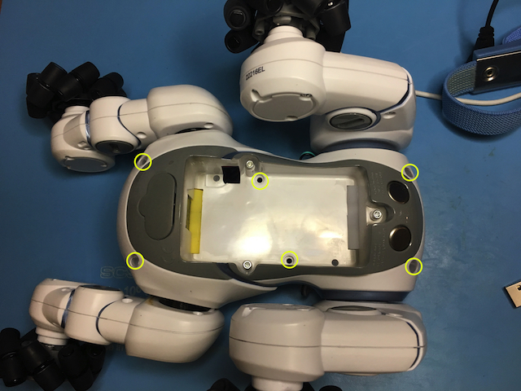

The top of CHiP's body can be easily pulled away from its bottom portion once these six screws have been removed. The following photo shows the internals that are initially exposed when the body parts are separated.
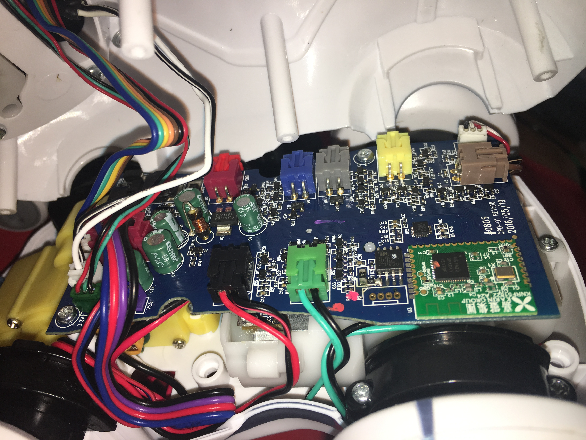

Sometimes when I picked up my CHiP, I would hear something banging around inside. I just thought it must have been some mechanism which was supposed to move around inside. After I opened up my CHiP, a spring fell out and I see no obvious place that it sprung from so I think it is an extra spring that has always been loose within CHiP's body.
 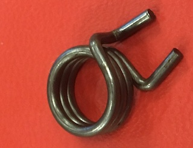 
I believe that this is an extra spring of the type used to transfer power from the motors to the legs in the hip. This allows the legs to be back driven by the user without causing any damage to the motor's gear train.

Now that I was inside the CHiP, I was able to disconnect all of the cables from the main PCB. WowWee color codes all of these connectors so it will be easy to reconnect them correctly in the future. After the cables had all been disconnected, only two Phillips screws needed to be removed to free the main PCB from CHiP's body.

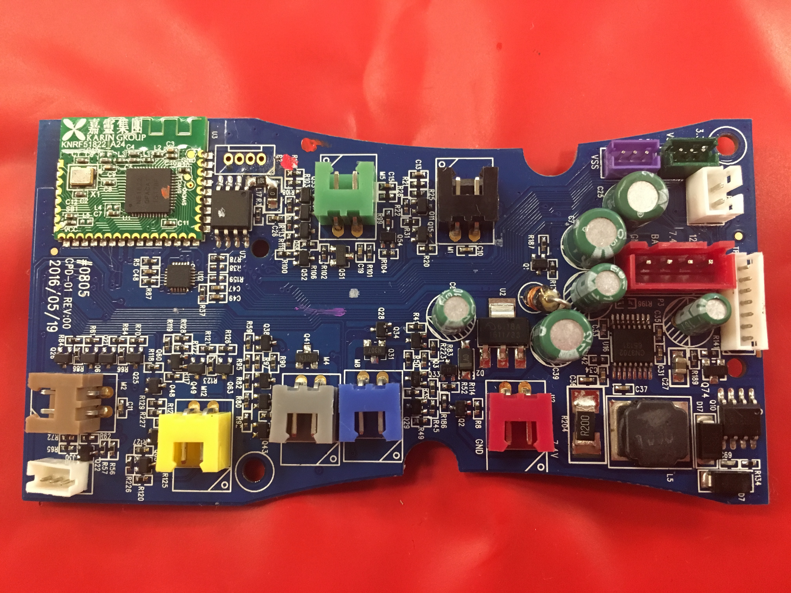
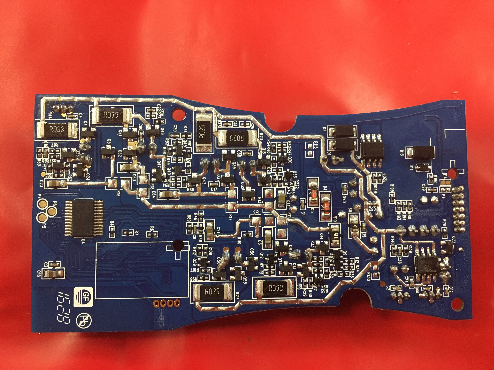

### Interesting ICs on Main PCB
#### U12 - 6DoF IMU??
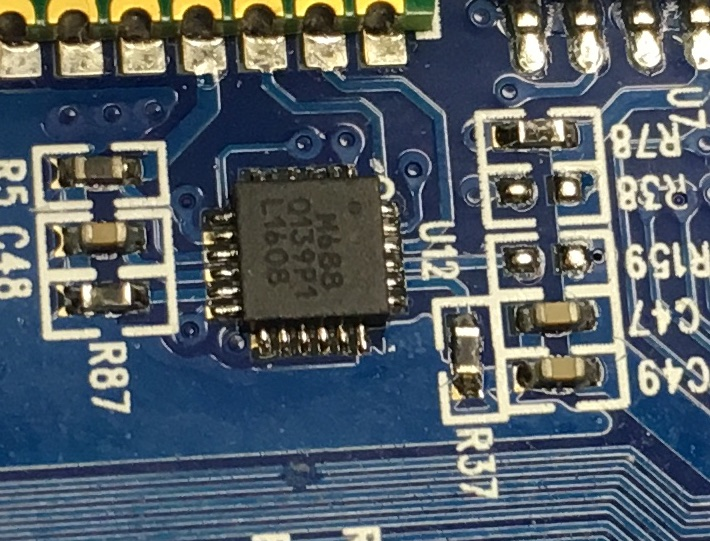 
This is a 24-pin IC that looks like it might be a [InvenSense MPU-6880 6-DoF IMU](http://www.szcdxkmcu.com/PIC/PIC/PS-MPU-6880-00%20v1.pdf). The power and ground pins match between the layout for this part and the datasheet but the part labeling is a bit different from that documented in the datasheet

#### U16 - Li-Ion Battery Charger IC
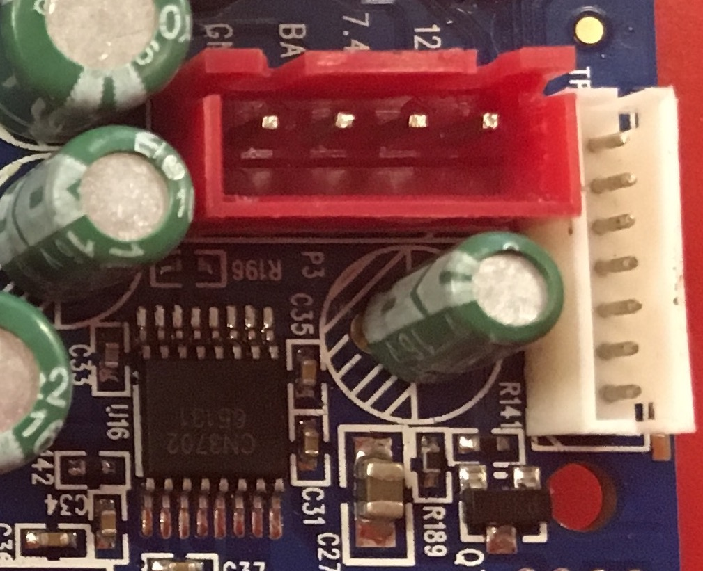 
This IC appears to be the [CN3702 5A, Li-Ion Battery Charger IC from Consonance Electronics](http://www.consonance-elec.com/seriesCN3702-E.html).

#### U3 - Nordic nRF51822 Bluetooth Low Energy Module
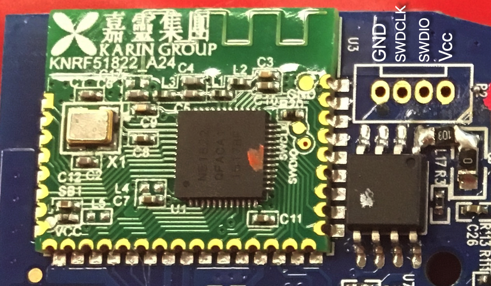 
This module contains a [Nordic nRF51822 BLE capable Cortex-M0 microcontroller](https://www.nordicsemi.com/?sc_itemid=%7BE343E4D9-21F1-4FBC-881F-10320A687576%7D). While this Cortex-M0 microcontroller could be the brains of the CHiP robot, I suspect that it isn't and it just acts as a BLE to serial bridge for the microcontroller actually in charge of CHiP's actions. In the image above, there is a footprint for a 4-pin through-hole header just to the right of the BLE module. This header exposes ARM's SWD (Single Wire Debug) signals and allows for debugging of the nRF51822 microcontroller. The SWDIO and SWCLK test points are cleared labelled on the BLE module and a multimeter confirmed that these 2 signals, GND, and Vcc are all routed out to this 4-pin header. I have labelled the header pins in the above diagram.

### Opening CHiP's Head
Once I had the PCB out of the body, it was time to turn my attention to CHiP's head and see what was inside. This meant grabbing the Phillips #0 screwdriver again and removing the four screws highlighted in the following photo of CHiP's back of head.
 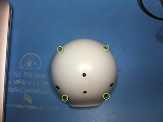 

The next photo shows the internals of the head revealed once the back of the head has been pulled away from the front. There are definitely a lot of cables in CHiP's head.
 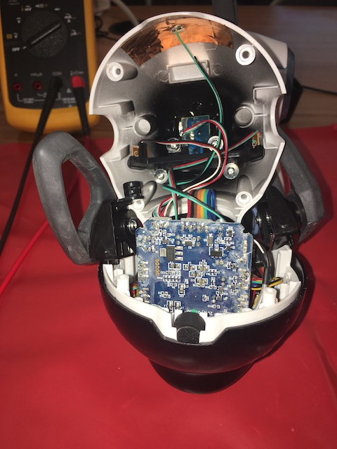 

Once I had carefully disconnected all of the cables from the PCB in the head (again they are all color coded for easy reassembly), I was able to slide the PCB out of the front portion of the head and fully expose the top and bottom of the PCB.
 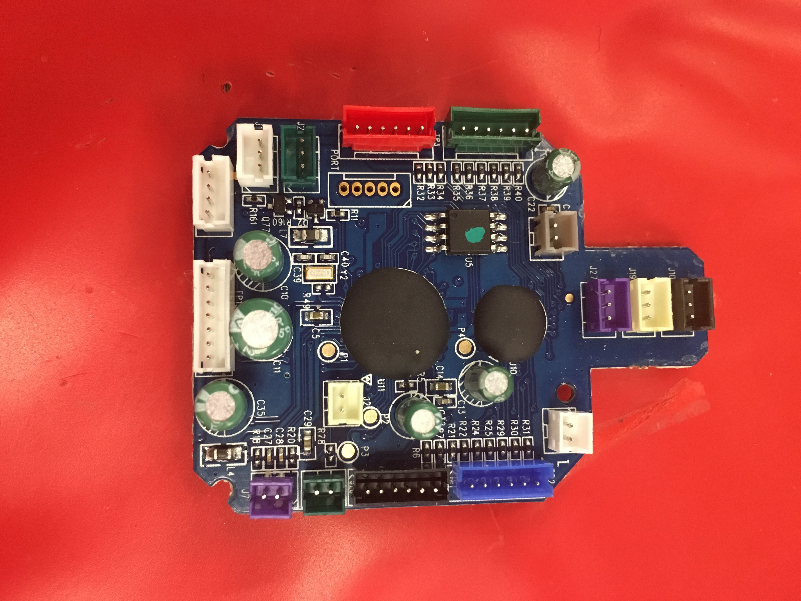
 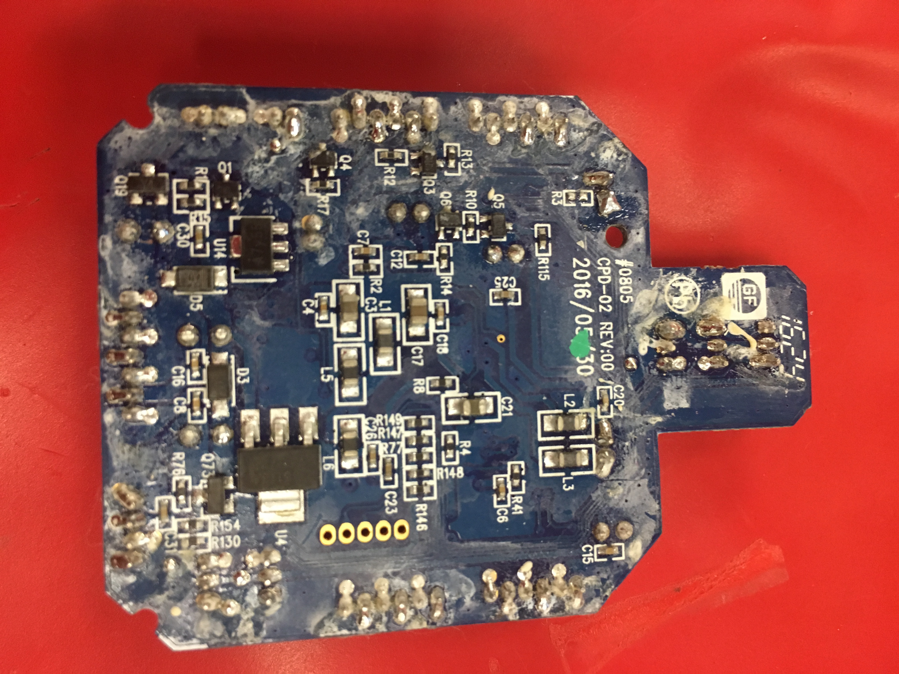 

There is an unpopulated through-hole header on this PCB as well. It can be seen just below the red connector in the top view of the PCB. Maybe this is a debug or UART port. I see no obvious markings to indicate exactly what it might be other than the word "PORT". The pins at either end carry power and ground and the other three appear to be routed towards the chip, **U11**, under the larger blob on the top of the PCB. I suspect that this is a microcontroller as it has a crystal, Y2, next to it. I also suspect that it is a [microcontroller from Nuvoton](https://www.nuvoton.com/hq/?__locale=en) since that is what the MiP used and the names of these [parameters from the Official CHiP iOS SDK](https://github.com/WowWeeLabs/CHIP-iOS-SDK/blob/master/chipsampleproject/Framework/WowweeChipSDK.framework/Headers/ChipRobot.h#L191).

It looks like the 8-pin IC labelled **U5** is probably a SPI based FLASH part like [MX25L1606E](https://www.netcheif.com/Reviews/7438RPn/MX25L1606E.pdf)

### Attaching a Debugger to the nRF51822 Module
 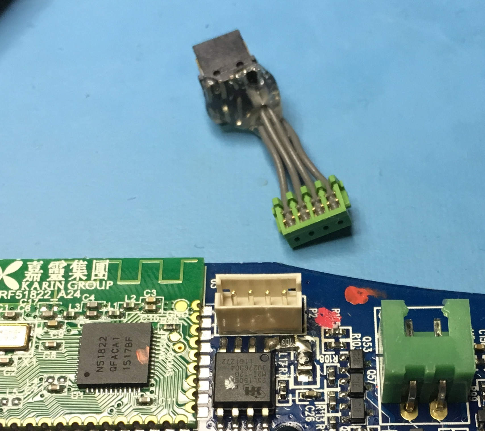 
What can we learn about the nRF51822 microcontroller through its debug port? To find out, I first soldered down a [4-position 1.5mm JST Connector](https://www.digikey.com/products/en?keywords=455-1659-ND) at the debug port location on the PCB. I then made an adapter cable by cutting a [JST 4-wire cable](https://www.digikey.com/product-detail/en/jst-sales-america-inc/A04ZR04ZR28H152A/455-3026-ND/6009402) in two and soldering a [Samtech 2x5 1.27mm header](https://www.digikey.com/products/en?keywords=SAM8799-ND) to the other end. The 4-pin JST connector can now be plugged into the debug port on CHiP's main PCB and the other end will accept a standard 2x5 Cortex-M debug cable. The pins are mapped between the order I labelled in an earlier photo of the 4-pin header and [ARM's Cortex Debug pinout](http://www.keil.com/support/man/docs/ulinkpro/ulinkpro_hw_if_jtag10.htm). The following photo shows a successful connection of the [SEGGER J-Link EDU Mini - JTAG/SWD Debugger](https://www.adafruit.com/product/3571) to the nRF51822 debug port using this adapter cable.
 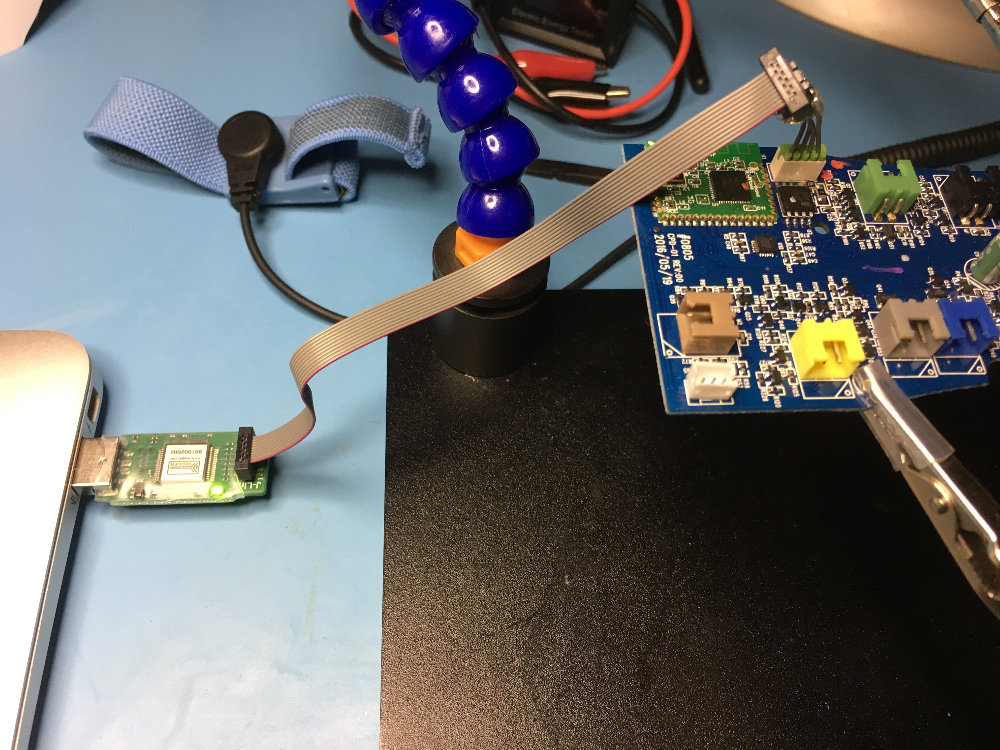 

I will hopefully document what I learn, if anything, from this debug connection in a future post.

## May 15th, 2018 - The Unofficial CHiP Bluetooth Low Energy Protocol
I just finished documenting what I learned about the CHiP BLE protocol while developing the [CHiP C API for macOS](https://github.com/adamgreen/CHiP-Capi#readme) and released it as the [Unofficial CHiP Bluetooth Low Energy Protocol Documentation](https://github.com/adamgreen/CHiP/blob/master/CHiP-BLE-Protocol.md#the-unofficial-chip-bluetooth-low-energy-protocol). I hope that others find it useful. I really look forward to seeing what others can accomplish with it.

I would like to note a few observations that I made while working with the CHiP BLE protocol:
* It can be used to build remote control applications that command CHiP where to move and what sounds to make.
* While the CHiP does contain sensors (IR, microphone, etc), I haven't yet found a way to request their readings via BLE like can be done with the MiP for IR gesture/radar measurements and clap detection. This makes it hard to program it to do anything that is autonomous without adding our own sensors.
* Can control what direction CHiP travels, but no low level control of leg and head placement. There are however some higher level actions/animations that can be used to give some such control.

## May 14th, 2018 - CHiP C API for macOS
I spent the weekend writing a library to allow me to control CHiP from macOS. This [CHiP C API for macOS](https://github.com/adamgreen/CHiP-Capi#readme) exposes functionality similar to what is found in [WowWee's CHiP iOS SDK](https://github.com/WowWeeLabs/CHIP-iOS-SDK#wowwee-chip-ios-sdk) and includes [several working samples](https://github.com/adamgreen/CHiP-Capi/tree/master/examples) and API documentation. I plan to write up some unofficial BLE protocol documentation pretty soon so that others can create similar libraries for their preferred hacking platforms.

## May 7th, 2018 - CHiP SmartBand Repair
When I first played around with my new CHiP robot, I noticed that the SmartBand wouldn't turn on. I plugged in the USB charging cable and the SmartBand's LED blinked with an inconsistent random blinking pattern, almost like there was a loose connection. I left it on the charger for a few hours, it still continued to blink in that same random pattern, and it would never activate.

If this had been a toy purchase for a child, I would have been pretty disappointed and tried to contact WowWee about getting a warranty replacement or returned it to the store where I bought it. Since I had every intention to take it apart at some point, voiding the warranty, I decided to take the SmartBand apart to see what I could see. Getting into the SmartBand was easy as it was only held together with 4 small Phillips head screws, accessible from the back of the band.

There are a few pieces of plastic that make up the SmartBand and they might be hard to get back together in the correct orientation except that WowWee added asymmetric keying to make it a cinch.

 

I was pretty suspicious that the Lithium Ion battery was defective and wouldn't take a charge. Once I had the SmartBand apart, I could easily access the pads to which the battery attached to the PCB. Putting the voltmeter on those pads showed less than 0.5V from the battery. That is definitely too low for a Lithium Ion battery and it was probably destroyed by being allowed to discharge too much.

I found that Adafruit sold a [3.7v 150mAh Lithium Ion Polymer Battery](https://www.adafruit.com/product/1317) that was comparable in size and capacity (the original was 130mAh). I added one of these batteries to my next Adafruit order and used it to replace the bad one which originally shipped with the CHiP. **NOTE:** If you are going to replace the battery yourself, you need to take caution and not short the batteries (original or replacement) as you are undertaking the repair.
* I cut each of the original battery's wires (black and red) close to the pads. I cut the wires one at a time and not both together so as not to short the battery across the surface of the cutters.
* If you look closely at the pads on the PCB, you should be able to see **+** and **-** symbols designating the polarity of the pads. If you can't see them, you should add markings to the PCB yourself to indicate which pad is to receive the red wire and which the black.
* I used the soldering iron to remove what was left of the battery wires from the PCB pads.
* The wires on the new battery from Adafruit include a connector that I didn't need and the wires are a bit longer than required for the SmartBand. I cut each of the new battery's wires to a length comparable to that of the wires on the original battery. Again, I cut each wire separately so as not to short the new battery across the cutting surface.
* I then stripped a few mm of insulation from the red, positive, wire of the new battery and tinned it in preparation for soldering to the **+** pad of the PCB. I added some flux to the **+** PCB pad and then soldered the red wire to it.
* I then did the same with the black, ground, wire and the **-** PCB pad. Be very careful to not short the ground wire to the positive wire or pad while you are soldering it down.
* I placed a small piece of Kapton insulating tape on top of the soldered pads to make sure that it wasn't easy to short. You could use black electrical tape instead.
* I removed the small foam pad from the old battery and attached it in roughly the same location on the new battery. It makes sure that the battery fits snugly in the SmartBand and the battery itself doesn't rest right up against the PCB.

Once I replaced the battery, the SmartBand started working as expected. Problem fixed!
